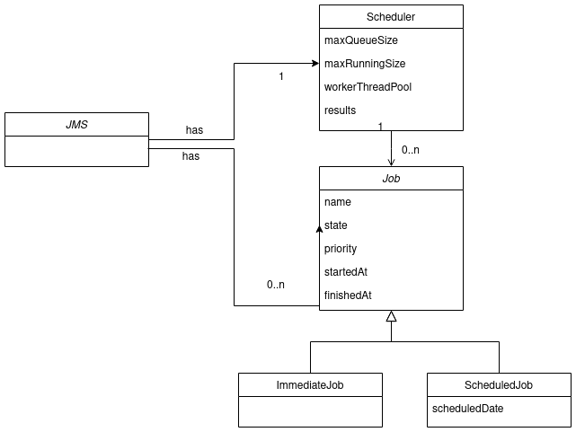

# Job Management System (JMS)

This is a functional prototype of a JMS built in Java.

This example implements some concepts to simulate an environment of a real Job Management System.
Some features are listed below:

- There is a limit of maximum concurrent jobs that can run at same time. Default is 2.
- There is a limit of the jobs that can be queued. After that, the job will be rejected. Default is
  50.
- There is a limit of time that a job can run, after that the scheduler will kill it. Default is 8s.

This JMS has support of two types of job: scheduledJob and immediateJob.

- scheduleJob - is a job that follow a predefined schedule to run. After this time, the scheduler
  will try to run the job as soon as there is a job executor available.
- immediateJob - is a job that will run at the moment it will be created.

Another feature supported in this JMS is priority. Jobs has priority defined by numbers. Higher
numbers means higher priority.



However, there are some simplifications. Jobs can only run once. Support to recurrence is something
that can be implemented in the future.

To run this project, just execute the following commands:
``` 
mvn clean install
java -jar target/JobManagementSystem-1.0-SNAPSHOT.jar 
``` 


